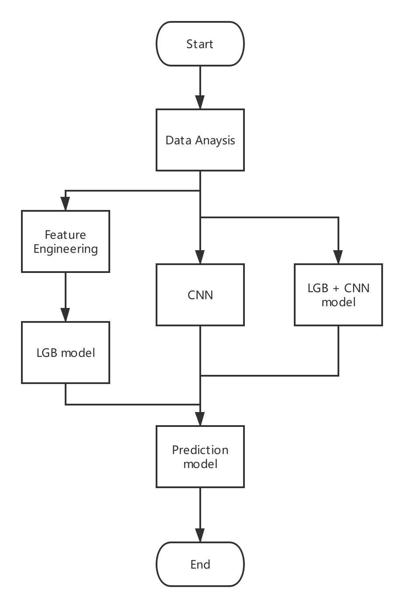

# Aliyun Security Maliware Detection

## Data Set

https://tianchi.aliyun.com/competition/entrance/231694/introduction

## Flow Diagram

## References

* [阿里云安全恶意程序检测，线上成绩0.443705，受邀分享比赛思路](https://tianchi.aliyun.com/notebook-ai/detail?spm=5176.12586969.1002.3.75c867b5H5JMb8&postId=56989)
* [API based sequence and statistical features in a combined malware detection architecture](http://jst.tsinghuajournals.com/CN/rhhtml/20180510.htm?WebShieldDRSessionVerify=yCHA5I2sqLqmh2INS4AO#)
* [Google Machine Learning Crash Courses](https://developers.google.com/machine-learning/crash-course/ml-intro)